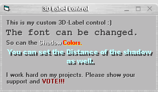



## \_ 3D Label Control \(UPDATE\)

### Description

Small update to my 3D-Label control. Added X and Y offset as separate coordinates instead of one integer acting as both. Vote if you like the code. Or at least leave some comments...I would appreciate it, thanks.
 
### More Info
 

             |
---                |---
**Submitted On**   |2003-12-05 02:16:20
**By**             |[KRYO\_11](https://github.com/Planet-Source-Code/PSCIndex/blob/master/ByAuthor/kryo-11.md)
**Level**          |Intermediate
**User Rating**    |4.7 (146 globes from 31 users)
**Compatibility**  |VB 5\.0, VB 6\.0
**Category**       |[Custom Controls/ Forms/  Menus](https://github.com/Planet-Source-Code/PSCIndex/blob/master/ByCategory/custom-controls-forms-menus__1-4.md)
**World**          |[Visual Basic](https://github.com/Planet-Source-Code/PSCIndex/blob/master/ByWorld/visual-basic.md)
**Archive File**   |[\_\_3D\_Label1680681252003\.zip](https://github.com/Planet-Source-Code/kryo-11-3d-label-control-update__1-50335/archive/master.zip)

